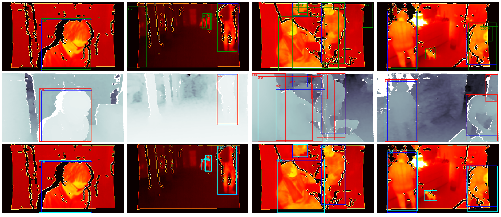

# Red-Hot-Deep-Blue

Red-Hot-Deep-Blue is a library that detects people in the thermal or depth images. It also performes fusion of both imaging sources.
It solves the task defined by the 2020 Looking at People Challenge FG Identity-preserved human detection  https://chalearnlap.cvc.uab.cat/challenge/34/description/,
so it is necessary to obtain the IPHD dataset to use the code without modifications. Library is written in PyTorch.

Pretrained models can be downloaded from:
1. single-model thermal https://drive.google.com/file/d/12lXTHx73SewOEWyjvnVvFO5UO0RbVfT0/view?usp=sharing
2. single-model depth https://drive.google.com/file/d/1mwt4RRv4qaFnj2TwtQKvavdu0bFSNLNO/view?usp=sharing
3. single-model early fusion

Models should be put in 'models' directory or you can need to change the path.

You can generate predictions using scripts:
1. 'demo/run_eval_depth.py' for depth images
2. 'demo/run_eval_thermal.py' for thermal images
3. for fusion
4. for early fusion

